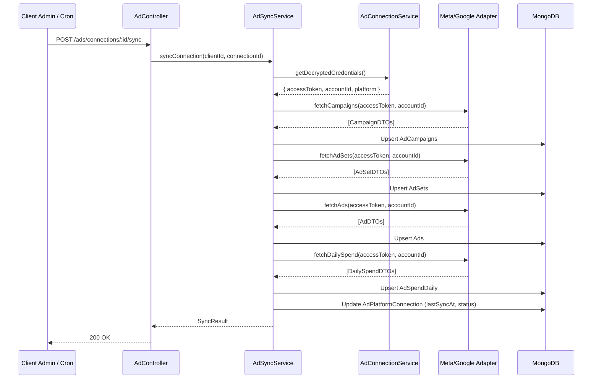

# Advertising Data Synchronization & Idempotent Processing

## Overview

The Synchronization Engine (`AdSyncService`) coordinates the scheduled and on-demand ingestion of advertising hierarchy and spend performance from connected ad platforms.

---

## 1. Synchronization Flow

---

## 2. Idempotency Guarantees

Repeated synchronization of the same date range or account will **never create duplicate records**:
- **`AdCampaign`**: Upserted using compound unique index `{ clientId: 1, platform: 1, externalCampaignId: 1 }`.
- **`AdSet`**: Upserted using `{ clientId: 1, externalAdSetId: 1 }`.
- **`Ad`**: Upserted using `{ clientId: 1, externalAdId: 1 }`.
- **`AdSpendDaily`**: Upserted using `{ clientId: 1, externalCampaignId: 1, date: 1 }`.

Metrics (impressions, clicks, spend, conversions, leads) are updated in place with the latest provider totals.

---

## 3. Resilient Error & Partial Failure Handling

External advertising APIs frequently suffer transient network timeouts or partial permission restrictions:
- **Partial Failure Resiliency**: If campaign data succeeds but an ad set or creative fetch encounters a temporary error (e.g. rate limit), the sync marks status as `'partial'`, commits the successful campaign spend data, and stores the failure details in `warnings`.
- **Fatal Credential Failures**: If the OAuth token has expired or is revoked by the user, the connection status is updated to `'expired'` or `'error'`, notifying administrators in the UI to reconnect without interrupting existing analytics.
