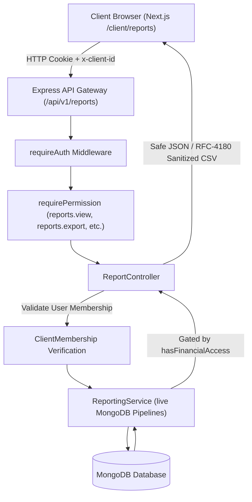

# flumenxConectOS — Release 9: Reporting & Analytics

## Executive Summary

Release 9 introduces a multi-tenant, permission-gated **Reporting & Analytics Engine** to **flumenxConectOS**. Built strictly on top of the verified Releases 1–8 foundations (Express.js, MongoDB/Mongoose, Next.js 14 App Router, and JWT HTTP-only cookie authentication), Release 9 delivers real-time business and operational intelligence without requiring background job queues, microservices, or external analytics SaaS platforms.

All calculations execute live on-demand via optimized MongoDB aggregation pipelines enforcing `{ clientId: clientObjectId }` at stage zero. Sensitive financial intelligence (ad spend, revenue, ROAS, and deal value) is strictly guarded at both the controller and service levels, ensuring that unauthorized staff and client administrators cannot view or extract financial records.

---

## Core Capabilities

1. **Executive Overview Dashboard**:
   - Total leads ingested, won leads, and deal conversion rate.
   - Website form submissions and yield.
   - Tasks completed and SLA compliance percentage.
   - Active communication threads across unified inbox channels.
   - Gated financial return strip: Total tracked ad spend, won revenue, and blended ROAS (strictly restricted to `reports.view_financial`).

2. **Period-over-Period Comparative Analytics**:
   - Supported range presets: `Today`, `Yesterday`, `Last 7 Days`, `Last 30 Days`, `This Month`, `Previous Month`, and `Custom Range` (up to 366-day safety ceiling).
   - Dynamic delta computation (`changePercentage` and `previousValue`) against equivalent previous timeframe.
   - Clean zero-handling preventing division-by-zero or `NaN` anomalies.

3. **Multi-Touch Attribution & Campaign Performance**:
   - First-touch, last-touch, and linear touchpoint distributions.
   - Channel breakdown: Meta Ads vs Google Ads vs Direct/Organic.
   - Campaign impressions, clicks, leads, CTR, CPC, and CPL.
   - **Zero Fabrication Policy**: Where reliable spend or revenue is absent, metrics return `null` or a clear 'N/A' indicator rather than fabricated zeros.

4. **Team Productivity & Operational Workload**:
   - Member-by-member assigned tasks, completed counts, open workload, and SLA breaches.
   - Task completion rate percentages.
   - Strictly restricted to actors possessing `reports.view_team`.

5. **RFC-4180 CSV Export with Formula Injection Defense**:
   - High-performance, streaming-ready CSV generator bounded to 5,000 rows.
   - OWASP CSV / Formula Injection defense applied across all metadata lines, column headers, and data cells (`=, +, -, @, \t, \r` neutralized with prepended single quote `'`).
   - Gated by `reports.export` permission.

6. **Custom Saved Views (Workspace vs Private)**:
   - Save filter presets, date ranges, and module focus.
   - Scope visibility to `workspace` (shared among authorized teammates) or `private` (restricted to creator).
   - Multi-tenant isolated: Cross-workspace access rejected with 404.

---

## Architecture & Data Flow

---

## Data Models

### 1. SavedReport (`backend/src/models/SavedReport.ts`)
Stores user-defined reporting views:
- `clientId`: Tenant ObjectId.
- `createdBy`: User ObjectId.
- `name`: User-facing view title.
- `description`: Optional notes.
- `reportType`: `'overview' | 'leads' | 'campaigns' | 'forms' | 'tasks' | 'team' | 'conversations' | 'custom'`.
- `filters`: Dynamic key-value filter parameters.
- `dateRange`: Range configuration (`preset`, `startDate`, `endDate`).
- `visibility`: `'workspace' | 'private'`.
- Compound Index: `{ clientId: 1, visibility: 1, createdBy: 1 }`.

### 2. ReportSnapshot (`backend/src/models/ReportSnapshot.ts`)
Optional snapshot storage for export audit or point-in-time state without maintaining an active caching layer:
- `clientId`: Tenant ObjectId.
- `reportType`: Type of report snapshot.
- `metrics`: Frozen metric values and counts.
- `generatedAt`: Generation timestamp.
- Compound Index: `{ clientId: 1, reportType: 1, generatedAt: -1 }`.

---

## Verification & Status

Release 9 has been verified with **68 comprehensive automated assertions** across 10 test sections in `backend/src/tests/reports.test.ts`, plus zero regressions across all 7 prior test suites (Auth, Client Management, Lead Management, Conversations, Website Forms, Ad Platform, Tasks).
